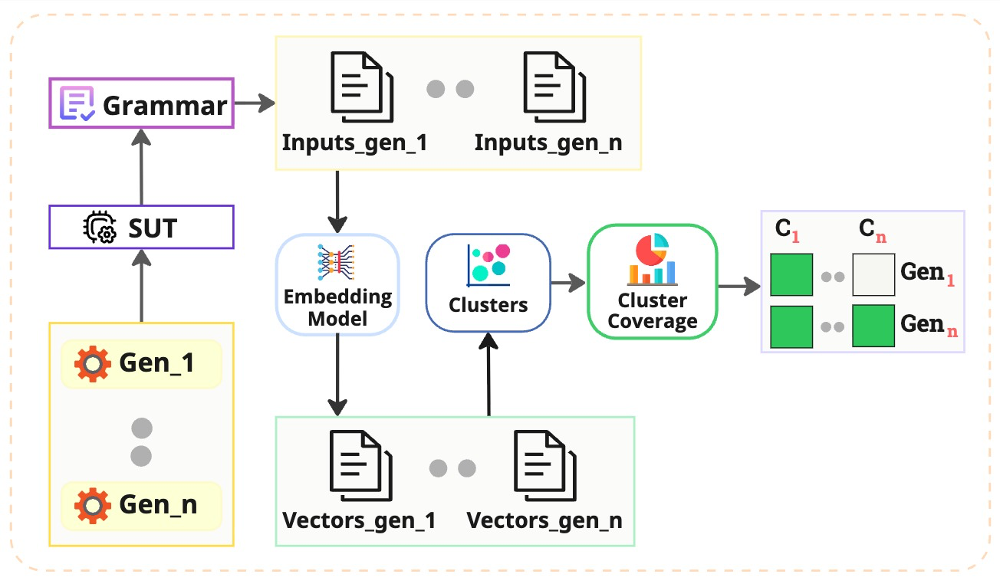
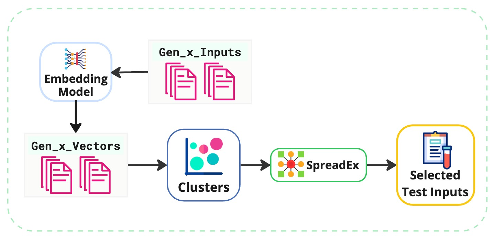

# SpreadEx

<p align="center">
  
</p>

**SpreadEx** is a diversity-driven testing workflow for grammar-based systems. It supports two complementary tasks:

1. **Generator Selection:** identify which grammar-based test generator produces the most diverse and fault-revealing input set.
2. **Input Prioritization:** select a budget-aware subset of inputs from a chosen generator using diversity maps.

This repository contains the replication package for the ICST 2026 paper:

> Embedding-based Diversity Mapping for Test Generator Selection and Input Prioritization in Grammar-based Testing  
> Accepted at ICST 2026

The package supports both fast result inspection and full reproduction from scratch.

This GitHub repository includes the lightweight SUTs used for smoke testing, including KarateJS. The complete artifact archive with all subject programs and full reproduction data is available on Zenodo: [https://doi.org/10.5281/zenodo.20071065](https://doi.org/10.5281/zenodo.20071065).

---

## Workflow Overview

SpreadEx evaluates grammar-based inputs by embedding them, clustering the resulting vectors, and using those clusters as diversity maps. The artifact is organized around two phases.

### Phase 1: Generator Selection

Phase 1 compares multiple input generators for a subject program. Each generator produces inputs from the same grammar; the inputs are embedded, clustered, and evaluated using **Cluster Coverage (CC)** and mutation-based effectiveness.

<p align="center">
  
</p>

Start here:

- [Phase 1 overview](docs/phase1_generator_selection.md)
- [Step-by-step Phase 1 guides](docs/phase1_generator_selection/)

### Phase 2: Input Prioritization

Phase 2 starts from a selected generator and prioritizes its inputs under increasing budgets. SpreadEx selects inputs across the diversity map so that the chosen test subset covers different behavioral regions.

<p align="center">
  
</p>

Start here:

- [Phase 2: Input Prioritization](docs/phase2_input_prioritization.md)

---

## Quick Paths

### Inspect Results

Use this path if you want to validate the results reported in the paper without re-running the experiments.

1. Open [data/](data/).
2. Read [docs/data_format_and_interpretation.md](docs/data_format_and_interpretation.md).
3. Inspect the processed Phase 1 and Phase 2 result folders.

No execution is required for result inspection.

### Reproduce Experiments

Use this path if you want to run the artifact from scratch.

1. Create a Python environment.
2. Install dependencies from [requirements.txt](requirements.txt).
3. Verify Java, JaCoCo, and PIT setup.
4. Follow the phase-specific documentation:
   - [Phase 1: Generator Selection](docs/phase1_generator_selection.md)
   - [Phase 2: Input Prioritization](docs/phase2_input_prioritization.md)

For first-time reproduction, we recommend using an IDE such as PyCharm or VS Code because the scripts expose their main configuration near the top of each file. All steps can also be run from the terminal.

---

## Repository Structure

```tree
.
├── data/
│   ├── Generator_Selection_Results/
│   ├── Input_Prioritization_Results/
│   └── Paper-Figure_plots/
│
├── docs/
│   ├── assets/
│   │   ├── spreadex_logo.png
│   │   ├── generator_selector.png
│   │   └── input_prioritization.png
│   ├── phase1_generator_selection.md
│   ├── phase1_generator_selection/
│   │   ├── 00_environment_setup.md
│   │   ├── step01_test_input_generation.md
│   │   ├── step02_embedding_generation.md
│   │   └── ... step09_adding_new_subject_program.md
│   ├── phase2_input_prioritization.md
│   ├── phase2_input_prioritization/
│   │   ├── 00_prerequisites.md
│   │   ├── step01_run_input_prioritization.md
│   │   └── ... step04_rq4_stability_analysis.md
│   └── data_format_and_interpretation.md
│
├── SUT/
│   ├── basic/
│   └── karate-v2/
│
├── Generation_Test_Inputs.py
├── Generation_Embeddings.py
├── Mutation_Analysis.py
├── Cluster_Coverage.py
├── Mutation_Scores_Generators.py
├── Correlations_MS_CC.py
├── Jaccard_Similarity_MS_CC.py
├── Analysis_Reports_Plots.py
├── requirements.txt
└── README.md
```

---

## Requirements

- Python >= 3.10
- Java >= 17
- Python packages listed in [requirements.txt](requirements.txt)
- JaCoCo agent/CLI jars for coverage analysis
- PIT command-line jars, PIT JUnit 5 plugin, and JUnit runtime jars for mutant export
- Optional generator CLIs: Fandango and ISLa, if those generators are enabled
- Optional API key: `OPENAI_API_KEY`, if OpenAI-based generation or embeddings are enabled

Create and activate a Python environment:

```bash
python3.10 -m venv .venv
source .venv/bin/activate
pip install -r requirements.txt
```

Verify the main runtimes:

```bash
python --version
java -version
```

---

## Java Tool Setup

The scripts use fixed local paths for Java coverage and mutation tools:

- JaCoCo agent/CLI: `COVERAGE_REPORTS/COVERAGE_TOOLS/Jacoco/`
- PIT command-line jars: `MUT_KILLING_PROFILE/pit_mut_tool/`

JaCoCo jars are included in this artifact under:

```tree
COVERAGE_REPORTS/COVERAGE_TOOLS/Jacoco/
├── jacocoagent.jar
└── jacococli.jar
```

PIT jars must be placed in:

```tree
MUT_KILLING_PROFILE/pit_mut_tool/
```

If Maven is available, the included [pitest-runtime-pom.xml](pitest-runtime-pom.xml) can fetch the required PIT and JUnit runtime jars:

```bash
mvn -Dmaven.repo.local=.m2/repository \
  -f pitest-runtime-pom.xml \
  org.apache.maven.plugins:maven-dependency-plugin:3.7.0:copy-dependencies \
  -DoutputDirectory=MUT_KILLING_PROFILE/pit_mut_tool \
  -DincludeScope=runtime
```

Expected PIT layout:

```tree
MUT_KILLING_PROFILE/
└── pit_mut_tool/
    ├── pitest-command-line-<version>.jar
    ├── pitest-<version>.jar
    ├── pitest-entry-<version>.jar
    ├── pitest-junit5-plugin-<version>.jar
    ├── junit-jupiter-engine-<version>.jar
    ├── junit-platform-launcher-<version>.jar
    └── ...
```

The temporary `.m2/` cache created by Maven does not need to be archived with the artifact.

---

## Documentation Map

- [Result data format and interpretation](docs/data_format_and_interpretation.md)
- [Phase 1: Generator Selection](docs/phase1_generator_selection.md)
- [Phase 2: Input Prioritization](docs/phase2_input_prioritization.md)
